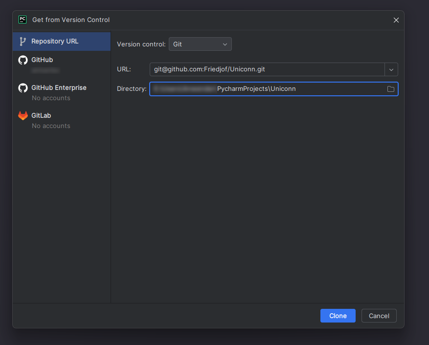
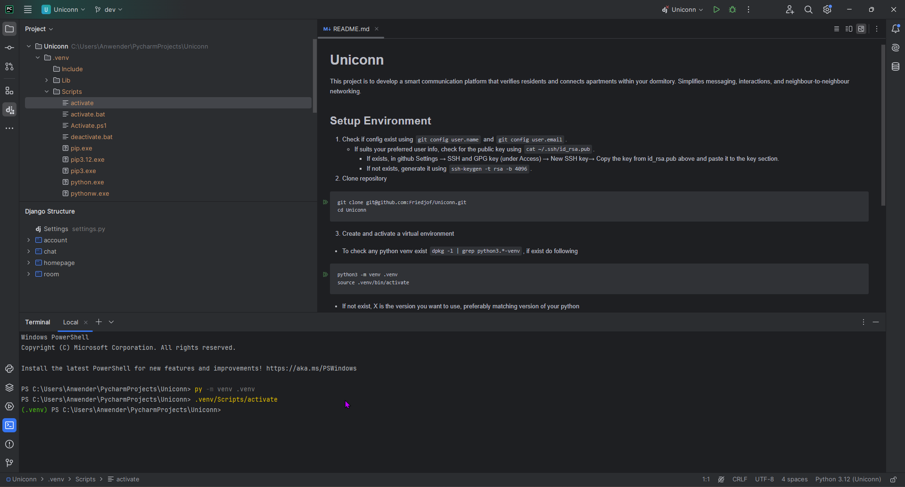
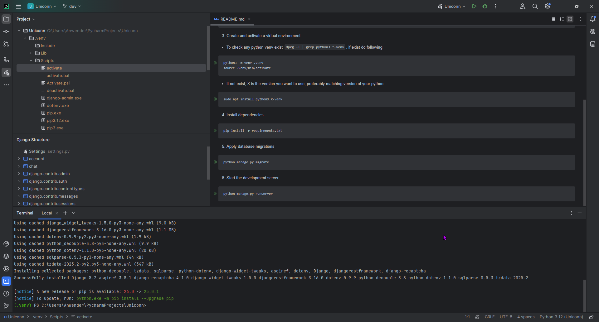
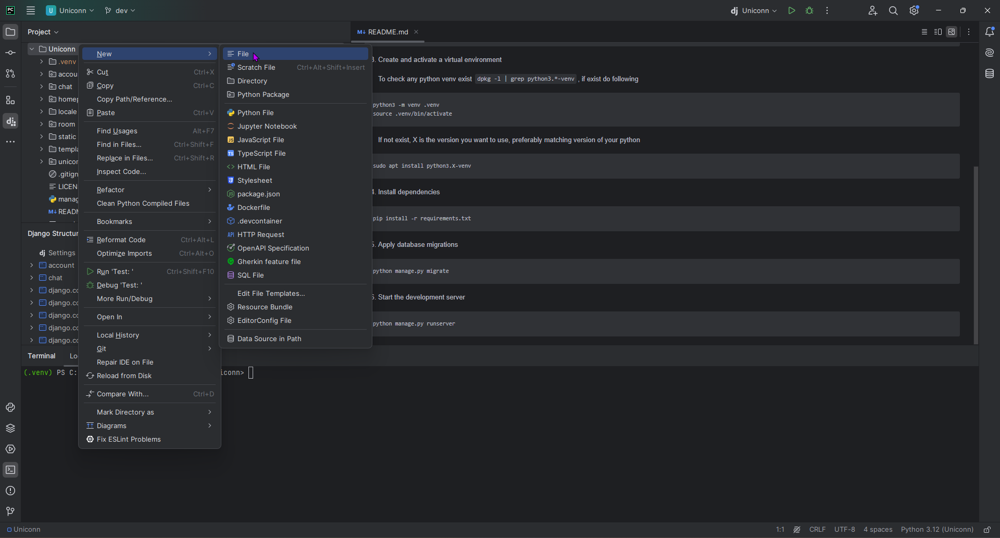
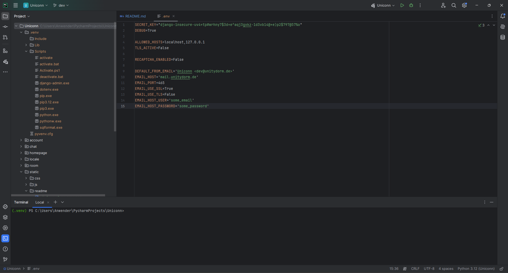
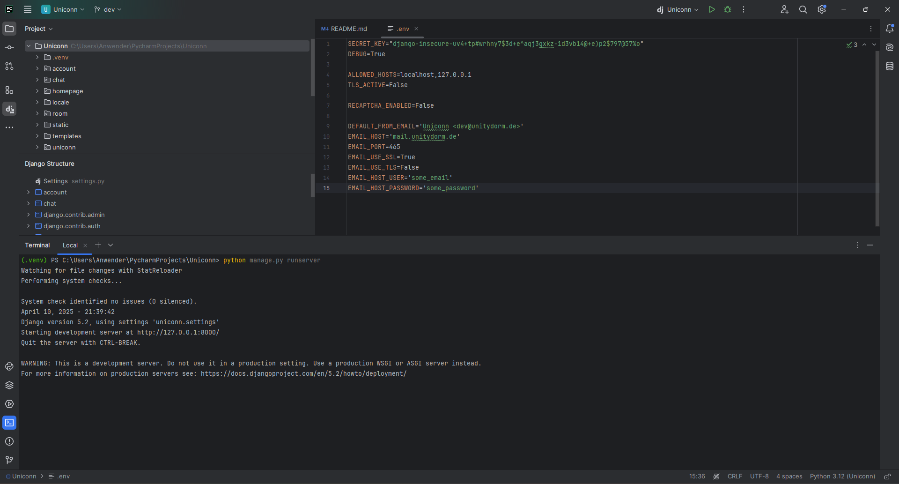
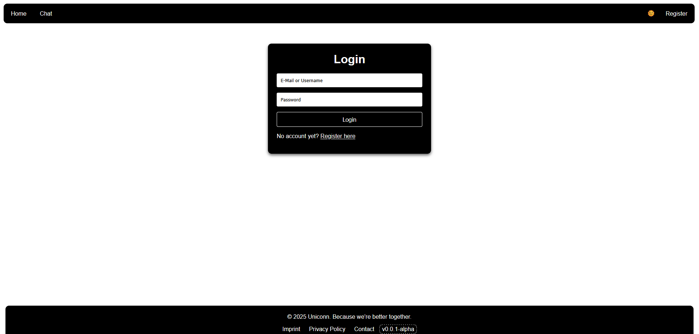

# Uniconn

## Project's idea.
This project is to develop a smart communication platform that verifies residents and connects apartments within your dormitory. Simplifies messaging, interactions, and neighbour-to-neighbour networking.

## Project's structure.
The project is structured as a Django web application with multiple apps, each handling specific functionalities:
- The account app manages user authentication and profiles
- The chat app handles real-time messaging.
- The homepage app serves the main landing page
- The room app likely manages chat rooms or similar features
- Shared templates and static files (CSS, JS) are organized under their respective folders, with reusable components like the navbar and footer
- The uniconn directory contains project-wide settings and configurations
- The locale folder supports internationalization with translations for multiple languages.

## - Setup Environment (Linux)

1. Check if config exists using ``` git config user.name``` and ```git config user.email```.
    * If suits your preferred user info, check for the public key using ```cat ~/.ssh/id_rsa.pub```.
        * If exists,  in github Settings &rarr; SSH and GPG key (under Access) &rarr; New SSH key&rarr; Copy the key from id_rsa.pub above and paste it to the key section.
        * If not exists, generate it using ```ssh-keygen -t rsa -b 4096```.

2. Clone repository

```bash
git clone git@github.com:Friedjof/Uniconn.git
cd Uniconn
```

3. Create and activate a virtual environment

* To check any python venv exist ```dpkg -l | grep python3.*-venv```, if exist do following

```bash
python3 -m venv .venv
source .venv/bin/activate
```

* If not exist, X is the version you want to use, preferably matching version of your python

```bash
sudo apt install python3.X-venv
```

4. Install dependencies

```bash
pip install -r requirements.txt
```

5. Apply database migrations

```bash
python manage.py migrate
```

6. Start the development server

```bash
python manage.py runserver
```

## - Setup Environment (Windows, PyCharm)

1. Check if config exists using ``` git config user.name``` and ```git config user.email```.
    * If suits your preferred user info, check for the public key using ```cat ~/.ssh/id_rsa.pub```.
        * If exists,  in github Settings &rarr; SSH and GPG key (under Access) &rarr; New SSH key&rarr; Copy the key from id_rsa.pub above and paste it to the key section.
        * If not exists, generate it using ```ssh-keygen -t rsa -b 4096```.


2. Clone repository [Jump to Windows Clone Repo](#windows_clone_repo)

```bash
git clone git@github.com:Friedjof/Uniconn.git
cd Uniconn
```

3. Create and activate a virtual environment [Jump to venv creation](#windows_clone_repo)

Important thing to notice: use local Python interpreter's path on your Windows machine (in my case it is "py").
In the ".venv" folder there are several folders, the one we need is Scripts, which has the "activate" script in order to activate our environment.
After the virtual environment is created, the interpreter can be called with the default "python".

```bash
python3 -m venv .venv
.venv/bin/activate
```

4. Install dependencies [[3](#windows_install_dependencies)]

```bash
pip install -r requirements.txt
```

5. Apply database migrations [[4](#windows_env_file_creation_1)]

In order to be able to migrate and also start the server, an .env file is needed, which has the needed configurations for the django server.

These are the contents of the .env file [[5](#windows_env_file_creation_2)]:

```
SECRET_KEY="django-insecure-uv4+tp#wrhny7$3d+e^aqj3gxkz-1d3vb14@+e)p2$797@57%o"
DEBUG=True

ALLOWED_HOSTS=localhost,127.0.0.1
TLS_ACTIVE=False

RECAPTCHA_ENABLED=False

DEFAULT_FROM_EMAIL='Uniconn <dev@unitydorm.de>'
EMAIL_HOST='mail.unitydorm.de'
EMAIL_PORT=465
EMAIL_USE_SSL=True
EMAIL_USE_TLS=False
EMAIL_HOST_USER='some_email'
EMAIL_HOST_PASSWORD='some_password'
```

6. Start the development server [[6](#windows_runserver)]

```bash
python manage.py runserver
```

In order to check the server's status, we enter the listed address and port:

```
http://127.0.0.1:8000/
```

We are then redirected to the current main page, which features a login form. [[7](#windows_server_online)]


## Windows Gallery


<table>
  <tr>
    <td id="windows_clone_repo">
      
    </td>
    <td id="windows_venv_activation">
      
    </td>
    <td id="windows_install_dependencies">
        
    </td>
    <td id="windows_env_file_creation_1">
        
    </td>
    <td id="windows_env_file_creation_2">
        
    </td>
    <td id="windows_runserver">
        
    </td>
    <td id="windows_server_online">
        
    </td>
  </tr>
</table>


